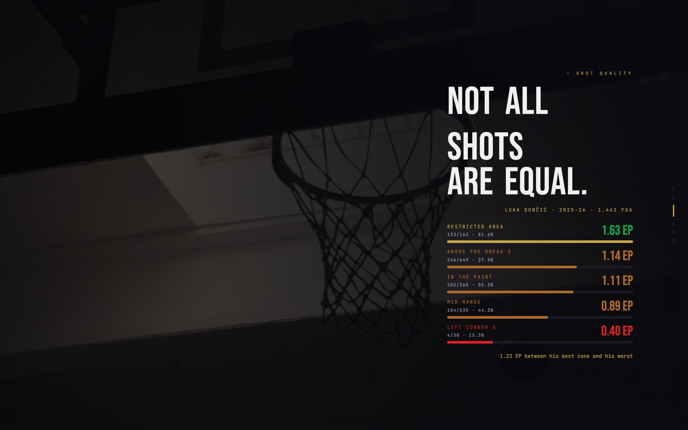
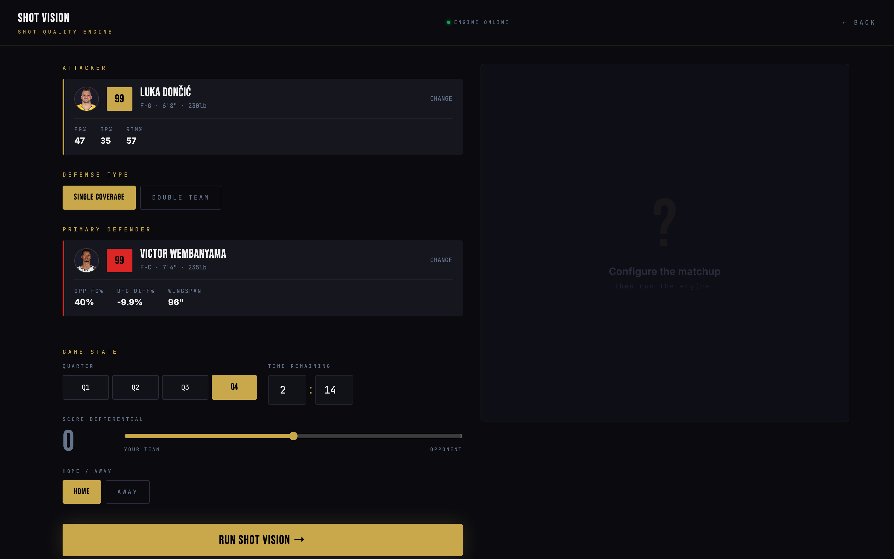
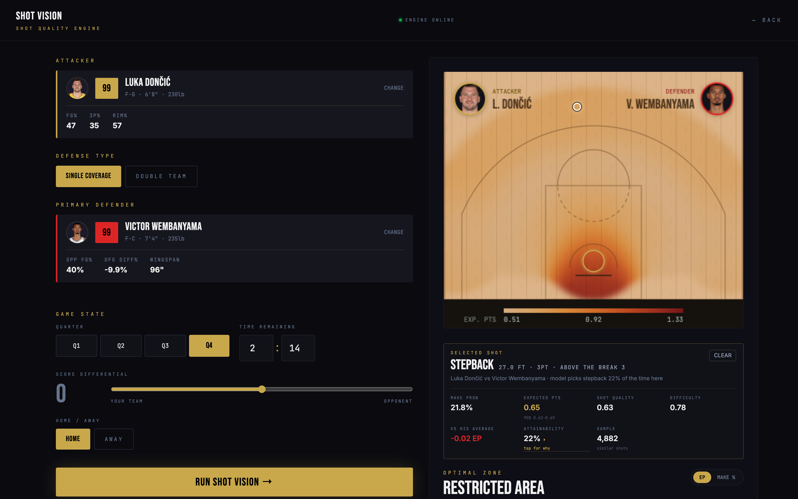
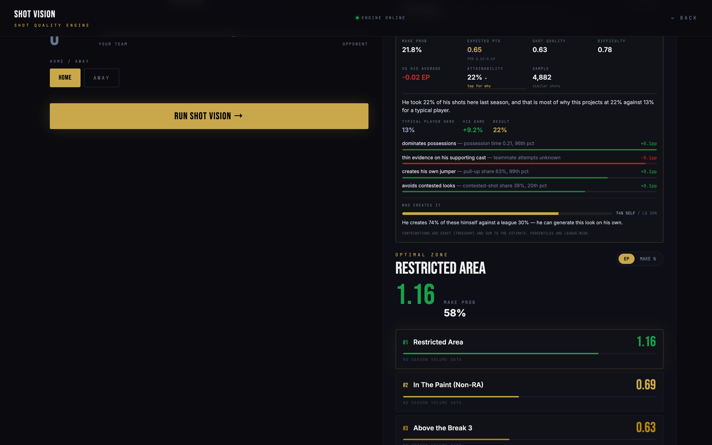

# SHOT VISION — NBA Shot Quality & Matchup Engine

Two XGBoost models over 2.1 million NBA shots — one predicting whether a shot goes
in, one predicting whether a player can generate that shot at all — served through
a FastAPI backend to a React frontend that explains every number it shows.


## What it actually answers

Ranking shot locations by expected points alone always recommends the restricted
area to every player on earth — true, and useless, since the rim is the most
efficient spot on the floor for everyone and the whole difficulty is *getting*
there. So the system pairs two questions:

1. **Shot quality** — P(make | a shot is taken from here), given the shooter, the
   named defender, and game state.
2. **Attainability** — what share of *this player's* shot diet plausibly comes
   from here, i.e. how readily he can actually generate the look — computed
   point-in-time from his season so far, his career, and his last season, not
   just what's efficient in the abstract.

The two are reported separately and combined into a ranking score, so the
interface can distinguish "this would be a great shot for you" from "this is a
shot you can actually get."



## The engine

Configure a real matchup — attacker, defender, single or double coverage, game
state — and get a live heat map plus ranked recommendations, each with a
confidence interval sized to how much evidence actually backs it.





### Click any shot to see why

Every attainability number opens into a full decomposition: what a typical player
gets here (baseline), what the player's own history says, which specific traits
move him off that baseline and by how much, and whether the shot is one he
generates himself or one that has to be created for him — all computed via exact
TreeSHAP contributions, so the reported reasons are guaranteed to sum to the
actual number, not an approximation of it.



## What was actually hard here (the findings)

The full version-by-version record — every number, every rejected feature, every
ablation — is in [`docs/model-versions.md`](docs/model-versions.md). The
short version:

- **The same leak was found and fixed twice, independently.** The original
  pipeline joined whole-season aggregates onto every shot in that season, so a
  shot's own outcome was inside its own feature. Fixed for shooters first,
  rediscovered for defenders later — `defender_stats` was still being joined by
  season alone. Both fixes required rebuilding the rate as a strictly
  prior-games-only, empirical-Bayes-shrunk quantity, computed identically at
  training and serving time.
- **A model can look free to cut and still be load-bearing.** Group ablation on
  the shot-quality model showed removing `shooter_skill` costs almost nothing in
  log-loss — but tanks zone-rank correlation from 0.740 to 0.727, the worst
  regression in the table. A single-metric read would have thrown out the thing
  that makes per-player rankings mean anything.
- **The attainability model was leaning on the wrong data for over a season and
  a half of iteration.** It had no access to a player's own shot diet — the
  single strongest predictor available (season-over-season autocorrelation
  0.94) — and separately, it trained only on completed seasons, so it couldn't
  see the *current* season at all. Twenty games of live evidence turned out to
  predict a player's rest-of-season shot diet better than his entire previous
  year. Restructuring the model to be genuinely point-in-time fixed both at
  once and produced the largest single accuracy gain in the project.
- **A leave-one-out feature was necessary, not optional.** Naively adding "how
  well does this player's team move the ball" credits a ball-dominant star with
  his *own* teammates' passing stats — Oklahoma City ranked 27th of 30 in team
  assist rate largely because Shai Gilgeous-Alexander creates so much of his own
  offense; strip him out and his actual teammates rank near the top of the
  league. Every team-context feature subtracts the player's own contribution
  before it reaches the model.
- **An explanation is a claim, and claims can be wrong in ways a metric won't
  catch.** Reading generated output by hand — not just checking that a number
  moved — caught three real bugs in the natural-language explanations: a
  sentence attributing a player's own history to "his game," a rate computed
  *this season* mislabeled as "last season," and a 0.2% share rendering as "0%"
  next to a nonzero number in the same sentence.

## Architecture

Full module-by-module breakdown — what each part of the codebase does and why —
is in [`docs/architecture.md`](docs/architecture.md).

```
nba_api → ingestion/ (22 scripts) → SQLite (12 tables, 3.5M shots)
                                          │
                                          ▼
                             features/  (point-in-time, shrunk, leak-free —
                                         ONE definition, shared by training
                                         and serving)
                                          │
                                          ▼
                     training/  (shot-quality + attainability, XGBoost,
                                  validated by feature-group ablation)
                                          │
                                          ▼
                      inference/  (FastAPI — same feature code, TreeSHAP
                                    explanations)
                                          │
                                          ▼
                    shot-vision-engine-main/  (React / TanStack Start)
```

The single guarantee the codebase is built around: `src/features/spec.py`
computes every derived feature exactly once, and both the training-matrix
builder and the live recommender call that same function. A test
(`tests/test_train_serve_parity.py`) asserts the two paths agree on identical
input — the failure mode it exists to catch already happened once, silently,
before this layer existed.

## Running it

```bash
pip install -r requirements.txt
python -c "from src.db.database import init_db; init_db()"

# Ingest data (see COMMANDS.md for the full, resumable pipeline —
# a full bootstrap across 10+ seasons takes several hours)
python -m src.ingestion.bootstrap --full

# Train both models
python -m src.training.train --name shot-quality
python -m src.training.attainability --name attainability

# Run it
./scripts/dev.sh
```

`./scripts/dev.sh` starts both the FastAPI backend and the React frontend on
fresh ports, wires them together automatically, and prints the URLs. See
[`COMMANDS.md`](COMMANDS.md) for the complete command reference — every
ingestion step, ablation flag, and evaluation tool in the project.

## Stack

**Backend:** Python, XGBoost, FastAPI, SQLAlchemy, SQLite + DuckDB (analytical
joins), pandas/numpy
**Frontend:** React, TypeScript, TanStack Start
**ML:** point-in-time feature engineering, empirical-Bayes shrinkage, monotone
constraints, TreeSHAP explanations, rolling-origin backtesting

## Documentation

- [`docs/architecture.md`](docs/architecture.md) — module-by-module breakdown
- [`docs/model-versions.md`](docs/model-versions.md) — full version history,
  every measured number, everything tried and rejected
- [`COMMANDS.md`](COMMANDS.md) — complete command reference
